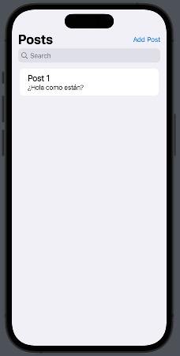
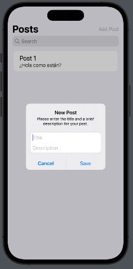
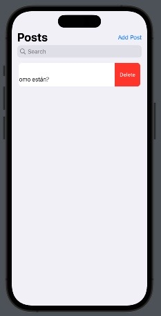

# CTIT Challange 2 - Posts Demo

Aplicación de iOS para la empresa CTIT el consiste en crear una pequeña aplicación en Swift, con RxSwift, que maneje Posts.

 
 


### Prerequisitos
* XCode 14 o superior

### Tecnología
* Swift 5
* SwiftUI
* RxSwift

### Instalación
* Clonar el repositorio
```
git clone https://github.com/gfreisz/CTITChallange2_iOS.git
```
* Ir a la carpeate del proyecto descargado y abrir el archivo CCITPost.xcodeproj

### Probar la aplicación
El proyecto usa Swift Package Manager para manejar la dependendecia con RxSwift por lo que al inicio, habra que esperar a que el proyecto termine de sincronizarse. Un vez terminada la sincronización, puede abrir el archivo CCITPostApp.swift para visualizar el layout y hacer uso de la app desde ahí o seleccionando un simulador y hacre click en Run.

### Funcionalidades
* Insertar posts
* Eliminar posts
* Listar posts
* Filtrar posts por nombre

### Autor
Gabriel Freisz ( gfreisz@gmail.com )
